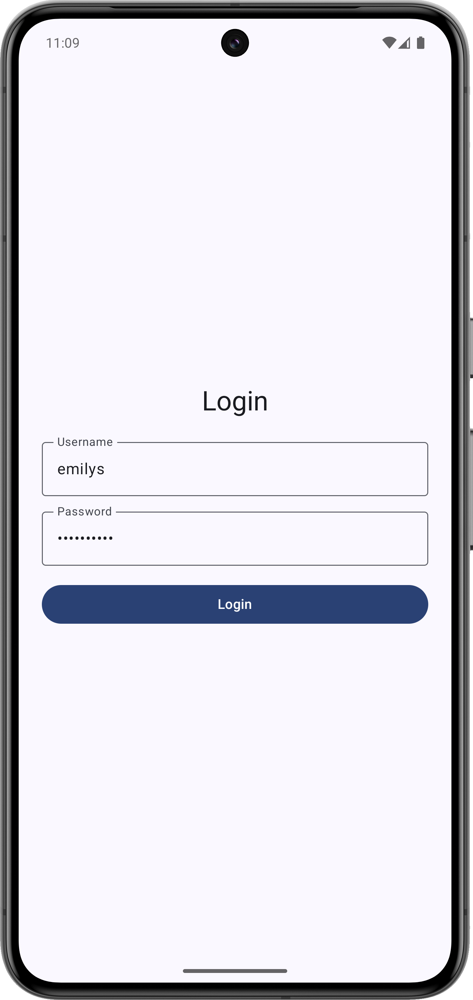
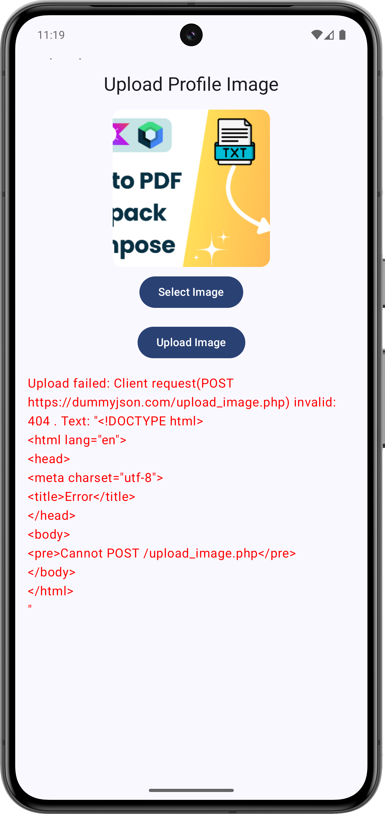

# 🚀 Jetpack Compose Ktor App Architecture


A starter template for building modern Android applications using Jetpack Compose, MVVM architecture, Ktor client, and Dependency Injection (Hilt).This project provides a ready-to-use base structure for Android apps with all essential setup done, so you can focus on building features instead of boilerplate.

---
## ✨ Features
- 🧩 **Clean Architecture** (Separation of Concerns)
- 🏗 **MVVM (Model-View-ViewModel)**
- 🧭 **Navigation Component for Compose**
- 🔗 **Ktor Client** for networking
- 💉 **Dependency Injection with Hilt** (Koin support coming soon)
- 🎨 **Jetpack Compose** for UI
- ⚡ **Coroutines + Flow** for async & reactive programming
- 📱 **Material 3** design components
---
## This template is perfect for developers who want a solid foundation to quickly start any Android project using modern best practices.
---
### ✅ Implemented Features with Ktor
- **Login API** – Authenticate users using the [DummyJSON API](https://dummyjson.com/)  
- **Get User Details API** – Fetch user profile and details after login  
- **Home Page** – Displays a **Quotes listing** with a **Logout option**  
- **Image Upload** – Upload images using Ktor  

### 🛠 How to use Image Upload
 In `MainActivity.kt`, 
```kotlin
// AppNavHost() comment out
UploadScreen()
Replace the image upload base URL with your own server URL in the UploadScreen code.
Run the app — you can now upload images to your server directly.
```
## 📲 App Screens
| Login                                         | UserDetails                                   | Image Upload                                  |
|-----------------------------------------------|-----------------------------------------------|-----------------------------------------------|
|  |  |  |

## 🏗️ Project Structure

<pre>
com.pixeldev.compose
│
├── data             // Handles data sources: API, Database, Cache
│   ├── remote       // Network-related classes (e.g., Retrofit/Ktor)
│   ├── local        // Local data (Room DB, SharedPrefs)
│   ├── repository   // Repository implementations
│   └── model        // Data-layer models (DTOs)
│
├── domain           // Business logic layer
│   ├── model        // Domain-layer models (Entities)
│   ├── repository   // Repository interfaces (contracts)
│   └── usecase      // Interactors or Use Cases
│
├── presentation     // UI Layer (Jetpack Compose Screens, ViewModels)
│   ├── feature1     // Each feature has its own module or folder
│   │   ├── ui       // UI components (Composables, Screens)
│   │   ├── viewmodel// ViewModel for the feature
│   │   └── mapper   // UI <-> Domain model mapper
│   └── ...
│
└── di               // Dependency Injection (e.g., Hilt/Koin modules)
</pre>

## 📦 Source Code

Full source code for this **Ktor + Compose starter template** is available on GitHub:  
👉 [GitHub @Dinesh2510](https://github.com/Dinesh2510)  

You can also check out the **Retrofit version** of the same project in the branch:  
🌿 [`compose-retrofit`](https://github.com/Dinesh2510/Jetpack-Compose-Ktor-App-Architecture/tree/compose-retrofit)  

🎥 Watch the step-by-step tutorial on my YouTube channel:  
👉 [YouTube - PixelDeveloper](https://www.youtube.com/@PixelDeveloper)  

⭐ Don't forget to **star the repo** if you find it helpful!


## 🙌 Contributions Welcome

Want to learn, improve, or contribute? Fork the repo, raise issues or open pull requests — let’s grow together!

---

